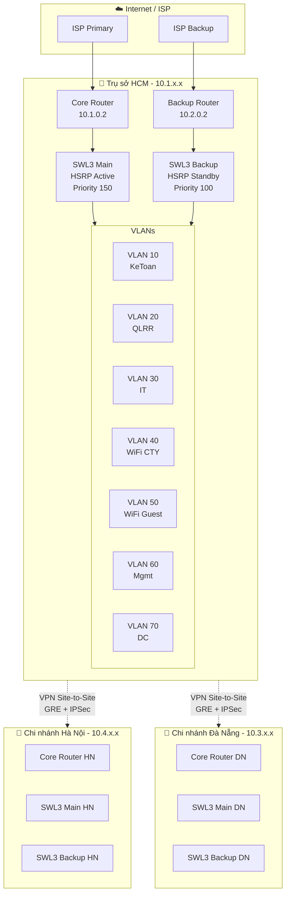

<p align="center">
  
  
  
  
  
</p>

# 🏦 FastPay Enterprise Network Design

> **Thiết kế hệ thống mạng doanh nghiệp cho Công ty Tài chính FastPay** — Bao gồm trụ sở chính TP.HCM và hai chi nhánh tại Hà Nội, Đà Nẵng. Hệ thống được thiết kế theo mô hình phân cấp 3 lớp (Core - Distribution - Access) với tính sẵn sàng cao, bảo mật nâng cao và khả năng mở rộng linh hoạt.

**Đồ án môn học:** NT113 - Thiết kế mạng  
**Trường:** Đại học Công nghệ Thông tin — ĐHQG TP.HCM (UIT)  
**Giảng viên hướng dẫn:** ThS. Bùi Thanh Bình

---

## 📋 Mục lục

- [Giới thiệu](#-giới-thiệu)
- [Tính năng chính](#-tính-năng-chính)
- [Kiến trúc tổng quan](#-kiến-trúc-tổng-quan)
- [Cài đặt](#-cài-đặt)
- [Chạy dự án](#-chạy-dự-án)
- [Cấu hình môi trường](#-cấu-hình-môi-trường)
- [Cấu trúc thư mục](#-cấu-trúc-thư-mục)
- [Hướng dẫn đóng góp](#-hướng-dẫn-đóng-góp)
- [License](#-license)
- [Roadmap](#-roadmap)

---

## 🌟 Giới thiệu

FastPay là một công ty tài chính với nhu cầu hạ tầng mạng **hiệu suất cao**, **bảo mật tối đa** và **tính sẵn sàng 24/7**. Dự án này cung cấp toàn bộ thiết kế và cấu hình mạng cho:

| Địa điểm | Vai trò | Mạng |
|-----------|---------|------|
| 🏢 **TP.HCM** | Trụ sở chính (HQ) | `10.1-2.x.x/24` |
| 🏢 **Đà Nẵng** | Chi nhánh miền Trung | `10.3.x.x/24` |
| 🏢 **Hà Nội** | Chi nhánh miền Bắc | `10.4.x.x/24` |

Hệ thống mạng được thiết kế đáp ứng các tiêu chuẩn khắt khe của ngành tài chính, bao gồm độ trễ thấp cho giao dịch trực tuyến, mã hóa dữ liệu đầu cuối, và khả năng chịu lỗi cao với cơ chế failover tự động.

---

## 🔑 Tính năng chính

### 🏗️ Kiến trúc phân cấp 3 lớp
- **Core Layer:** Router biên kết nối WAN/Internet
- **Distribution Layer:** Switch Layer 3 với HSRP Active/Standby
- **Access Layer:** Switch Layer 2 phân chia theo VLAN phòng ban

### 🔄 Tính sẵn sàng cao (High Availability)
- **HSRP (Hot Standby Router Protocol):** Gateway ảo với failover tự động
- **Dual Router:** Mỗi site có Core Router + Backup Router
- **Dual SWL3:** Active/Standby Switch Layer 3 với STP

### 🌐 Định tuyến thông minh
- **OSPF (Open Shortest Path First):** Multi-area cho inter-site routing
- **OSPF Cost Tuning:** Ưu tiên đường chính, backup tự động nhận lưu lượng
- **Default Route Redistribution:** Kết nối Internet qua ISP

### 🔒 Bảo mật nâng cao
- **ACL (Access Control List):** Kiểm soát truy cập giữa các VLAN
- **WiFi Guest Isolation:** Tách biệt hoàn toàn mạng khách với mạng nội bộ
- **Zero Trust Architecture:** Deny by default, chỉ permit traffic cần thiết
- **VPN Site-to-Site:** GRE + IPSec cho kết nối an toàn liên chi nhánh

### 📡 Phân tách VLAN
| VLAN ID | Tên | Mục đích |
|---------|-----|----------|
| 10 | KeToan | Phòng Kế toán |
| 20 | QuanLyRuiRo | Phòng Quản lý rủi ro |
| 30 | IT | Phòng Công nghệ thông tin |
| 40 | WiFi_CTY | WiFi nội bộ công ty |
| 50 | WiFi_Guest | WiFi dành cho khách |
| 60 | Management | Quản lý thiết bị mạng |
| 70 | DataCenter | Trung tâm dữ liệu (chỉ HCM) |

### ☁️ Hybrid Cloud
- **Public Cloud (AWS/GCP):** Xử lý giao dịch trực tuyến
- **Private Cloud (OpenStack):** Lưu trữ dữ liệu tài chính quan trọng
- **SIEM (Wazuh):** Giám sát log tập trung & phát hiện xâm nhập

---

## 🏛️ Kiến trúc tổng quan



---

## 📥 Cài đặt

### Yêu cầu hệ thống

| Phần mềm | Phiên bản | Ghi chú |
|-----------|-----------|---------|
| **Cisco Packet Tracer** | 8.2+ | Mô phỏng mạng |
| **Git** | 2.x+ | Quản lý source code |

### Bước 1: Clone repository

```bash
git clone https://github.com/tofumapu/fastpay-network-design.git
cd fastpay-network-design
```

### Bước 2: Mở file topology

```
1. Khởi động Cisco Packet Tracer
2. File → Open → topology/physical_design_2911.pkt
3. Chờ tất cả thiết bị khởi động hoàn tất (khoảng 30s)
```

---

## 🚀 Chạy dự án

### Mở mô phỏng mạng

```
1. Mở file topology/fastpay-network.pkt bằng Cisco Packet Tracer
2. Kiểm tra trạng thái các interface (tất cả phải lên màu xanh)
3. Sử dụng công cụ "Simple PDU" để test ping giữa các VLAN
```

### Kiểm tra kết nối cơ bản

```cisco
! Từ bất kỳ PC nào trong VLAN 10 (KeToan):
ping 10.1.10.1      ! Ping Gateway HSRP
ping 10.1.20.10     ! Ping qua VLAN 20 (QLRR)
ping 8.8.8.8        ! Ping Internet (qua ISP)
```

### Kiểm tra HSRP Failover

```cisco
! Trên SWL3-Main:
show standby brief

! Tắt SWL3-Main để kiểm tra failover:
! SWL3-Backup sẽ tự động nhận vai trò Active
```

### Kiểm tra OSPF Neighbors

```cisco
show ip ospf neighbor
show ip route ospf
```

---

## ⚙️ Cấu hình môi trường

### Bảng quy hoạch IP Address

| Site | Subnet | Gateway (HSRP VIP) | SWL3 Main | SWL3 Backup |
|------|--------|---------------------|-----------|-------------|
| **HCM - VLAN 10** | 10.1.10.0/24 | 10.1.10.1 | 10.1.10.2 | 10.1.10.3 |
| **HCM - VLAN 20** | 10.1.20.0/24 | 10.1.20.1 | 10.1.20.2 | 10.1.20.3 |
| **HCM - VLAN 30** | 10.1.30.0/24 | 10.1.30.1 | 10.1.30.2 | 10.1.30.3 |
| **HCM - VLAN 40** | 10.1.40.0/24 | 10.1.40.1 | 10.1.40.2 | 10.1.40.3 |
| **HCM - VLAN 50** | 10.1.50.0/24 | 10.1.50.1 | 10.1.50.2 | 10.1.50.3 |
| **HCM - VLAN 60** | 10.1.60.0/24 | 10.1.60.1 | 10.1.60.2 | 10.1.60.3 |
| **HCM - VLAN 70** | 10.1.70.0/24 | 10.1.70.1 | 10.1.70.2 | 10.1.70.3 |
| **DN - VLAN 10** | 10.3.10.0/24 | 10.3.10.1 | 10.3.10.2 | 10.3.10.3 |
| **DN - VLAN 20** | 10.3.20.0/24 | 10.3.20.1 | 10.3.20.2 | 10.3.20.3 |
| **DN - VLAN 30** | 10.3.30.0/24 | 10.3.30.1 | 10.3.30.2 | 10.3.30.3 |
| **DN - VLAN 40** | 10.3.40.0/24 | 10.3.40.1 | 10.3.40.2 | 10.3.40.3 |
| **DN - VLAN 60** | 10.3.60.0/24 | 10.3.60.1 | 10.3.60.2 | 10.3.60.3 |
| **HN - VLAN 10** | 10.4.10.0/24 | 10.4.10.1 | 10.4.10.2 | 10.4.10.3 |
| **HN - VLAN 20** | 10.4.20.0/24 | 10.4.20.1 | 10.4.20.2 | 10.4.20.3 |
| **HN - VLAN 30** | 10.4.30.0/24 | 10.4.30.1 | 10.4.30.2 | 10.4.30.3 |
| **HN - VLAN 40** | 10.4.40.0/24 | 10.4.40.1 | 10.4.40.2 | 10.4.40.3 |
| **HN - VLAN 60** | 10.4.60.0/24 | 10.4.60.1 | 10.4.60.2 | 10.4.60.3 |

### DHCP Pool Ranges

| Pool | Main SWL3 Range | Backup SWL3 Range |
|------|-----------------|-------------------|
| Mỗi VLAN | `.10` → `.120` | `.121` → `.254` |

### Thông tin credential (Development)

> ⚠️ **Lưu ý:** Tất cả mật khẩu trong file config đã được thay thế bằng placeholder `<PASSWORD>`. Trong môi trường production, hãy thay thế bằng mật khẩu mạnh và kích hoạt `service password-encryption`.

---

## 📁 Cấu trúc thư mục

```
fastpay-network-design/
├── 📄 README.md
├── 📄 LICENSE
├── 📄 .gitignore
│
├── 📂 configs/
│   ├── 📂 hcm/                    # Trụ sở chính TP.HCM
│   │   ├── core-router.ios        # Core Router cấu hình
│   │   ├── backup-router.ios      # Backup Router cấu hình
│   │   ├── swl3-main.ios          # Switch L3 Active (HSRP Pri 150)
│   │   ├── swl3-backup.ios        # Switch L3 Standby (HSRP Pri 100)
│   │   └── swl2-access.ios        # Tất cả Switch L2 Access
│   │
│   ├── 📂 hanoi/                   # Chi nhánh Hà Nội
│   │   ├── swl3-main.ios          # Switch L3 Active
│   │   ├── swl3-backup.ios        # Switch L3 Standby
│   │   └── swl2-access.ios        # Tất cả Switch L2 Access
│   │
│   ├── 📂 danang/                  # Chi nhánh Đà Nẵng
│   │   ├── core-router.ios        # Core Router DN
│   │   ├── swl3-main.ios          # Switch L3 Active
│   │   ├── swl3-backup.ios        # Switch L3 Standby
│   │   └── swl2-access.ios        # Tất cả Switch L2 Access
│   │
│   └── 📂 security/               # Chính sách bảo mật
│       └── acl-policies.ios       # ACL cho cả 3 site
│
├── 📂 topology/                    # File mô phỏng Packet Tracer
│   └── fastpay-network.pkt        # Topology chính (phiên bản mới nhất)
│
└── 📂 docs/                       # Tài liệu bổ sung
    └── (IP Planning, Diagrams...)
```

---

## 🤝 Hướng dẫn đóng góp

Chúng tôi hoan nghênh mọi đóng góp! Hãy làm theo các bước sau:

### 1. Fork & Clone

```bash
git fork https://github.com/tofumapu/fastpay-network-design.git
git clone https://github.com/<your-username>/fastpay-network-design.git
```

### 2. Tạo branch mới

```bash
git checkout -b feature/ten-tinh-nang
```

### 3. Quy tắc đặt tên branch

| Loại | Format | Ví dụ |
|------|--------|-------|
| Tính năng mới | `feature/mô-tả` | `feature/add-vpn-config` |
| Sửa lỗi | `fix/mô-tả` | `fix/ospf-area-mismatch` |
| Tài liệu | `docs/mô-tả` | `docs/update-ip-table` |

### 4. Commit & Push

```bash
git add .
git commit -m "feat: thêm cấu hình VPN Site-to-Site"
git push origin feature/ten-tinh-nang
```

### 5. Tạo Pull Request

Mô tả rõ ràng những thay đổi và lý do trong PR description.

### Quy tắc coding cho config IOS

- Sử dụng `hostname` rõ ràng theo format: `<SITE>-<ROLE>` (VD: `HCM-SWL3-MAIN`)
- Không commit mật khẩu thật — sử dụng placeholder `<PASSWORD>`
- Thêm `description` cho mọi interface uplink
- Mỗi thiết bị tách thành file `.ios` riêng biệt

---

## 📜 License

Dự án này được phân phối theo giấy phép [MIT License](LICENSE).

---

## 🗺️ Roadmap

### ✅ Hoàn thành (v1.0)
- [x] Thiết kế phân cấp 3 lớp cho 3 site
- [x] VLAN segmentation (7 VLANs tại HCM, 6 tại HN/DN)
- [x] HSRP Active/Standby trên Switch L3
- [x] OSPF Multi-area routing
- [x] DHCP Pool với split range (Main/Backup)
- [x] Spanning Tree Primary/Secondary
- [x] ACL bảo mật inter-VLAN
- [x] Mô phỏng trên Cisco Packet Tracer

### 🔄 Đang phát triển (v1.1)
- [ ] VPN Site-to-Site (GRE + IPSec) giữa HCM ↔ HN ↔ DN
- [ ] Cấu hình Firewall Layer 7 (ASA/FortiGate)
- [ ] IDS/IPS Integration (Snort/Suricata)
- [ ] SIEM deployment (Wazuh)

### 🔮 Tương lai (v2.0)
- [ ] Hybrid Cloud Integration (AWS VPC + OpenStack)
- [ ] SD-WAN thay thế VPN truyền thống
- [ ] Network Automation (Ansible playbooks cho IOS)
- [ ] DevSecOps Pipeline cho infrastructure
- [ ] AI/ML-based threat detection
- [ ] Monitoring Dashboard (Grafana + Prometheus)

---

<p align="center">
  <b>Nhóm thực hiện</b><br/>
  Nguyễn Lê Nhật Đăng (Trưởng nhóm) · Trần Hải Đăng · Huỳnh Minh Đạt · Phan Hồng Đạt<br/><br/>
  <i>Trường Đại học Công nghệ Thông tin — ĐHQG TP.HCM</i><br/>
  <i>Môn NT113 - Thiết kế Mạng · GVHD: ThS. Bùi Thanh Bình</i>
</p>
